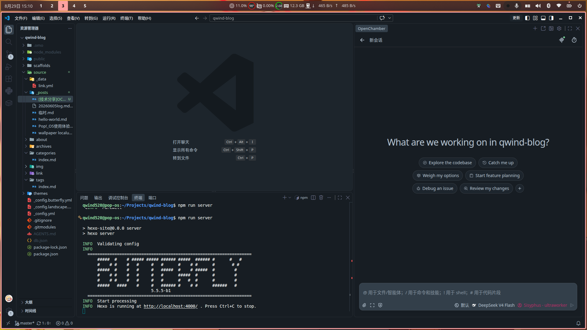
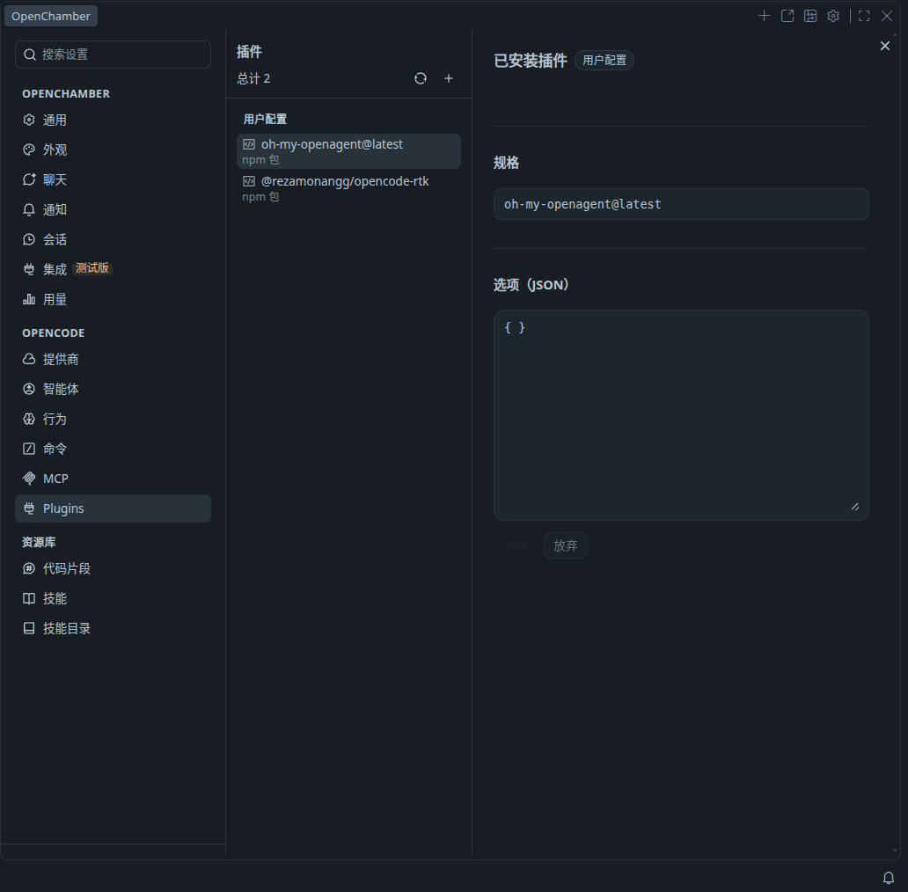

## 使用感言

本人使用 [OpenCode](https://opencode.ai) 进行 AI 辅助开发近 4 个月，觉得非常好用，于是作此分享。

先说说我都给 OpenCode 加装了什么吧：

- [OpenCode](https://opencode.ai) 本体 —— 开源终端 AI 编程代理
- [OpenChamber](https://github.com/openchamber/openchamber) VSCode 扩展 —— 给 OpenCode 加上桌面 / 网页 / 编辑器多端界面
- [OhMyOpencode](https://github.com/opensoft/oh-my-opencode)（现名 [oh-my-openagent](https://www.npmjs.com/package/oh-my-openagent)）—— OpenCode 大整合插件，开箱即用的智能体编排（后台并行 Agent、LSP/AST 工具、Claude Code 兼容层）
- [Opencode-rtk](https://www.npmjs.com/package/@rezamonangg/opencode-rtk) —— 压缩 terminal 输出插件，依赖 [RTK](https://github.com/rtk-ai/rtk)，日常命令可省 60%~90% token
- 一些 skills

## 快速安装

**OpenCode：**

推荐通过 npm 全局安装（需先安装 Node.js >= 20.19，也是我当前用的方式）：

```bash
npm install -g opencode-ai
```

> 官方也提供免 Node 的安装脚本：`curl -fsSL https://opencode.ai/install | bash`，按需二选一即可。

**OpenChamber：**

直接在 VSCode 搜索并安装扩展「OpenChamber」，也可在 [VS Code Marketplace](https://marketplace.visualstudio.com/items?itemName=FedaykinDev.openchamber) 找到。

**OhMyOpencode（现名 oh-my-openagent）：**

插件本体通过 npm 安装，再把它加进 opencode 的插件配置：

```bash
npm install -g oh-my-openagent
```

然后在 `~/.config/opencode/opencode.jsonc`（或 `opencode.json`）里启用：

```jsonc
{
  "$schema": "https://opencode.ai/config.json",
  "plugin": ["oh-my-openagent@latest"]
}
```

**Opencode-rtk：**

以我使用的 `@rezamonangg/opencode-rtk` 为例，先装好 RTK 二进制并放进 PATH，再把插件加进配置：

```bash
# 1. 安装 RTK 二进制（Linux/macOS）
curl -fsSL https://raw.githubusercontent.com/rtk-ai/rtk/master/install.sh | sh
# 或 brew install rtk
```

```jsonc
// ~/.config/opencode/opencode.jsonc
{
  "$schema": "https://opencode.ai/config.json",
  "plugin": ["oh-my-openagent@latest", "@rezamonangg/opencode-rtk"]
}
```

最后在 `~/.config/opencode/` 下安装插件依赖（npm 方式）：

```bash
cd ~/.config/opencode
npm install
```

## 阅读文档

- [OpenCode 文档](https://opencode.ai/docs)
- [OpenChamber 文档](https://docs.openchamber.dev)
- [oh-my-openagent](https://github.com/opensoft/oh-my-opencode)
- [@rezamonangg/opencode-rtk](https://www.npmjs.com/package/@rezamonangg/opencode-rtk)

## 使用截图





